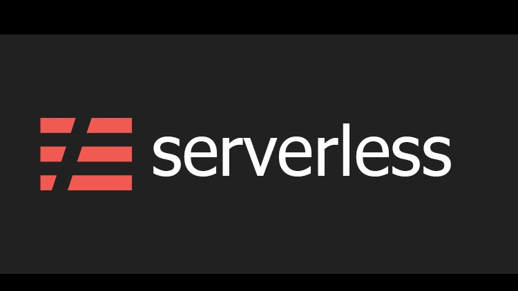
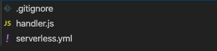

# Create Serverless Project
### Tools to install
1. NodeJS    
[](https://nodejs.org/es/download/)
2. NPM   
[](https://www.npmjs.com/)
3. Serverless Framework   
[](https://www.serverless.com/)

## Step1
> Create folder to save serverless project
```
$ mkdir serverless-microservice && cd serverless-microservice
```

## Step 2
> Create serverless template from cli
```
$ serverless create --template aws-nodejs --path serverless-microservice --name serverless
```

> This will create a directory serverless-microservice with the following structure



- .gitignore: This file is used to tell git which files should be kept outside of the repository
- handler.js: This declares your Lambda function. The created Lambda function returns a body with Go Serverless v1.0! Your function executed successfully! message
- serverless.yml: This file declares configuration that Serverless Framework uses to create your service. 
    - serverless.yml file has three sections
        - provider: This section declares configuration specific to a cloud provider. You can use it to specify name of the cloud provider, region, runtime, etc
        - functions: This section is used to specify all the functions that your service is composed off. A service can be composed of one or more functions
        - resources: This section declares all the resources that your functions use. Resources are declared using AWS CloudFormation
```yml
service: serverless

provider:
  name: aws
  runtime: nodejs12.x

functions:
  hello:
    handler: handler.hello

Resources:
    NewResource:
       Type: AWS::S3::Bucket
       Properties:
         BucketName: my-new-bucket
```
## Step 3
> Invoke a function from local environment
```
sls invoke local -f hello
```

## Deploy serverless function into AWS
